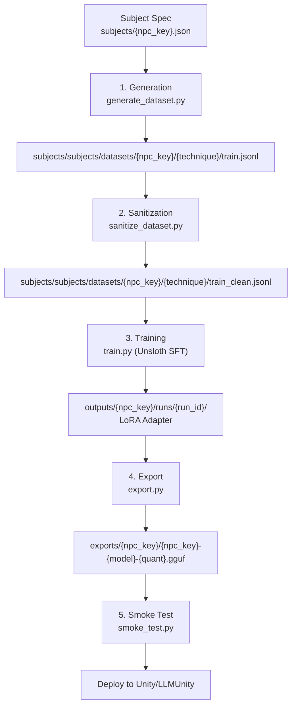
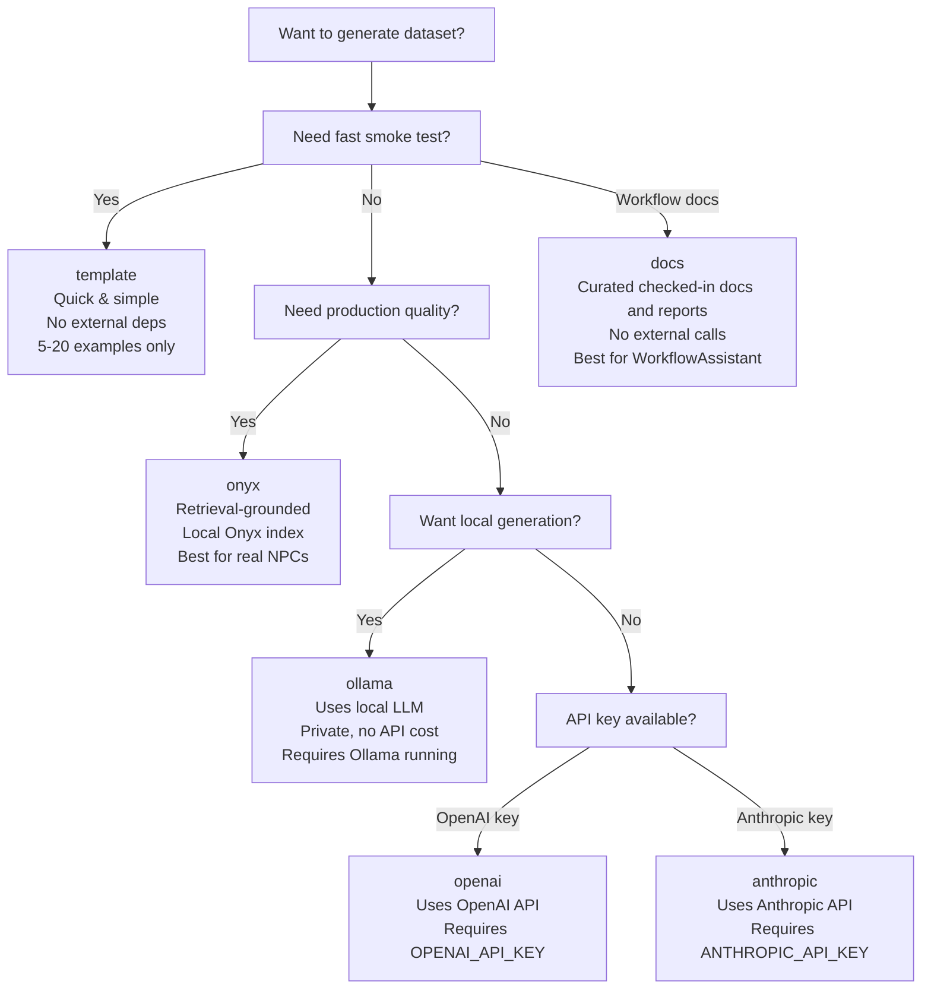
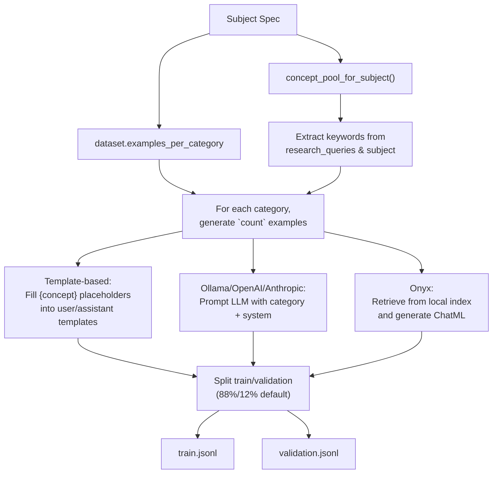
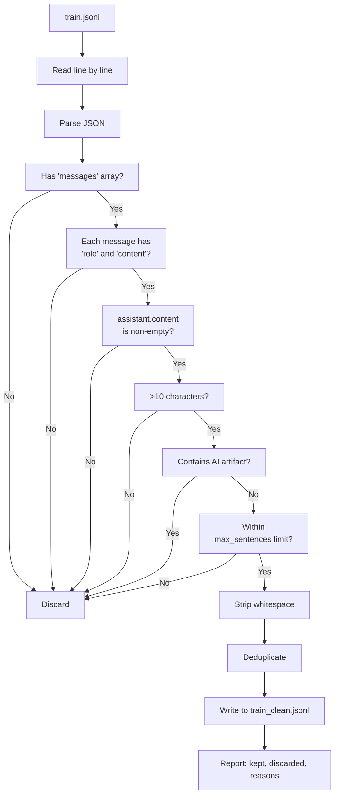
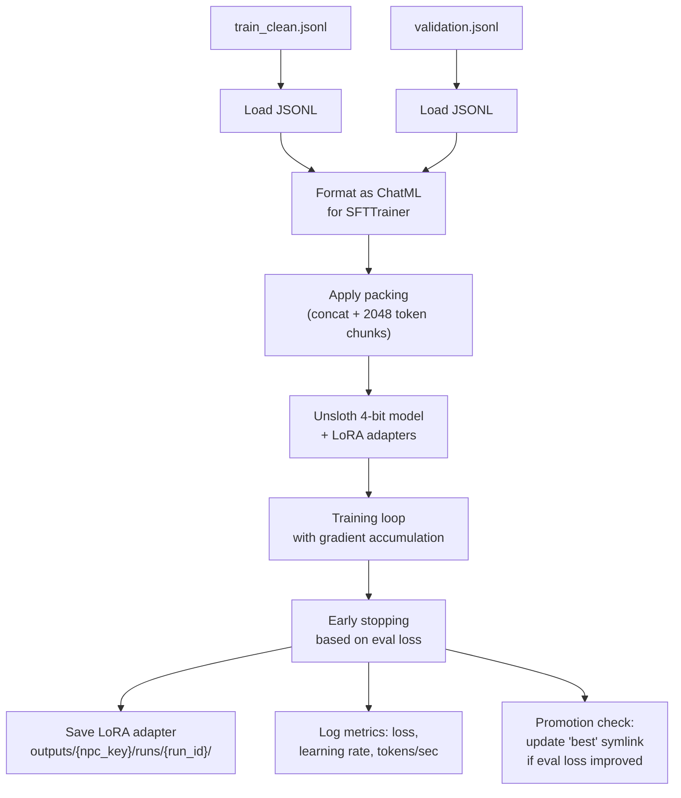

# Dataset Structure, Minimum Requirements & Logic Flow

This document provides a comprehensive walkthrough of the Unsloth_Core dataset lifecycle: from subject spec through generation, sanitization, training, export, and deployment. It includes canonical filesystem layout, ChatML record format, generation techniques, sanitization rules, and minimum requirements for each pipeline stage.

---

## 1. End-to-End Data Flow Overview



**Stage summary:**

| Stage | Script | Input | Output | Description |
|-------|--------|-------|--------|-------------|
| 1. Generation | `generate_dataset.py` | Subject spec | `train.jsonl`, `validation.jsonl` | Produces Q&A pairs in ChatML format using templates or LLMs |
| 2. Sanitization | `sanitize_dataset.py` | `train.jsonl` | `train_clean.jsonl` | Validates structure, removes AI artifacts, enforces length limits |
| 3. Training | `train.py` | `train_clean.jsonl` | LoRA adapter (PEFT) | Fine-tunes a 4-bit base model via Unsloth SFTTrainer |
| 4. Export | `export.py` | LoRA adapter | GGUF quantized file | Merges LoRA into base, quantizes for deployment |
| 5. Smoke Test | `smoke_test.py` | GGUF file | Validation report | Tests persona adherence and response quality |

**Quick one-shot pipeline:**
```bash
./ucore pipeline subjects/{npc_key}.json --preset smoke --technique template
```

---

## 2. Canonical Filesystem Layout

```
project_root/
│
├── subjects/datasets/                          # All generated training data
│   └── {npc_key}/                     # One directory per NPC
│       ├── docs/                      # Curated checked-in docs / reports corpus
│       │   ├── train.jsonl
│       │   ├── train_clean.jsonl
│       │   └── validation.jsonl
│       ├── onyx/                      # Production default — Onyx retrieval-grounded data
│       │   ├── train.jsonl
│       │   ├── train_clean.jsonl
│       │   └── validation.jsonl
│       ├── ollama/                    # Local LLM-generated data
│       │   ├── train.jsonl
│       │   ├── train_clean.jsonl
│       │   └── validation.jsonl
│       ├── template/                  # Template-based (smoke/prototyping only)
│       │   ├── train.jsonl
│       │   ├── train_clean.jsonl
│       │   └── validation.jsonl
│       ├── openai/                    # OpenAI API-generated data
│       │   ├── train.jsonl
│       │   ├── train_clean.jsonl
│       │   └── validation.jsonl
│       └── anthropic/                 # Anthropic API-generated data
│           ├── train.jsonl
│           ├── train_clean.jsonl
│           └── validation.jsonl
│
├── outputs/                           # LoRA adapters + training artifacts
│   └── {npc_key}/
│       ├── best -> runs/{best_run_id}       # Symlink to lowest-eval-loss run
│       ├── latest -> runs/{latest_run_id}   # Symlink to most recent run
│       └── runs/
│           └── {run_id}/                    # e.g. 20260513_fast-3b_001
│               ├── adapter_config.json      # PEFT adapter configuration
│               ├── adapter_model.safetensors # Trained LoRA weights
│               ├── tokenizer.json
│               ├── tokenizer_config.json
│               ├── config.yaml              # Full frozen training config
│               ├── metrics.json             # Final training metrics
│               └── run_manifest.json        # Provenance: dataset hash, preset, model ID
│
├── exports/                           # Deployable GGUF artifacts
│   └── {npc_key}/
│       ├── {npc_key}-{model_short}-{quant}.gguf  # Quantized model file
│       ├── manifest.json                       # Export provenance metadata
│       └── export_status.json                  # Export job status
│
└── eval/
    └── reports/
        └── {npc_key}/                  # Evaluation reports per NPC
```

### Key directory explanations

- **`subjects/datasets/{npc_key}/{technique}/`** — Each technique gets its own subdirectory. The `technique` directory name matches the generation method used. This keeps provenance clear and allows side-by-side comparison.
- **`subjects/datasets/{npc_key}/onyx/reference_doc/`** — NPC-specific grounding content and source documents for Onyx retrieval.
- **`train.jsonl`** — Raw generated data (Stage 1 output).
- **`train_clean.jsonl`** — Sanitized data ready for training (Stage 2 output).
- **`validation.jsonl`** — Held-out set for evaluation during training. Generated simultaneously with the training split.
- **`outputs/{npc_key}/runs/{run_id}/`** — One directory per training run, keyed by `YYYYMMDD_preset_sequential` (e.g., `20260513_fast-3b_001`). Contains the full LoRA adapter and run config.
- **`outputs/{npc_key}/best`** — Symlink always pointing to the run with the lowest evaluation loss. Updated automatically during training by the promotion check.
- **`outputs/{npc_key}/latest`** — Symlink always pointing to the most recent run.
- **`exports/{npc_key}/{npc_key}-{model_short}-{quant}.gguf`** — The final deployable artifact. Filename embeds NPC key, base model short name, and quantization level (default: `q4_k_m`).

### Path helper functions (`_config/paths.py`)

All path construction is centralized in `_config/paths.py`. Key function signatures:

| Function | Returns |
|----------|---------|
| `dataset_dir(npc_key)` | `subjects/datasets/{npc_key}/` |
| `dataset_train_path(npc_key, technique)` | `subjects/datasets/{npc_key}/{technique}/train.jsonl` |
| `dataset_val_path(npc_key, technique)` | `subjects/datasets/{npc_key}/{technique}/validation.jsonl` |
| `dataset_reference_dir(npc_key, technique)` | `subjects/datasets/{npc_key}/{technique}/reference_doc/` |
| `output_dir(npc_key)` | `outputs/{npc_key}/` |
| `run_dir(npc_key, run_id)` | `outputs/{npc_key}/runs/{run_id}/` |
| `export_dir(npc_key)` | `exports/{npc_key}/` |
| `export_gguf_path(npc_key, model_id, quant)` | `exports/{npc_key}/{npc_key}-{model_short}-{quant}.gguf` |

Valid techniques: `docs`, `onyx`, `ollama`, `openai`, `anthropic`, `template` (declared in `DATASET_TECHNIQUES`).

The `is_canonical_train_path()` function validates a path against the `subjects/datasets/{npc_key}/{technique}/train.jsonl` pattern. The `autodetect_dataset()` function auto-discovers the best available dataset by checking techniques in priority order: `docs` > `onyx` > `ollama` > `openai` > `anthropic` > `template`.

---

## 3. ChatML Record Format (The Core Data Unit)

Every line in a JSONL dataset file is one JSON object representing a single dialogue turn. The format follows the ChatML convention.

### Schema

```json
{
  "messages": [
    {"role": "system", "content": "You are ChemistryInstructor. Subject: General chemistry..."},
    {"role": "user", "content": "What is an acid?"},
    {"role": "assistant", "content": "An acid is a substance that donates H+ ions in water."}
  ],
  "metadata": {
    "npc_key": "chemistry_instructor",
    "category": "teaching",
    "source": "onyx"
  }
}
```

### `messages` array

| Index | Role | Content | Description |
|-------|------|---------|-------------|
| 0 | `system` | System prompt from subject spec | Sets the NPC's persona, rules, and constraints. Identical across all records for a given NPC. |
| 1 | `user` | Player's question | The input the player would type. Should sound like a real person. |
| 2 | `assistant` | NPC's response | The training target. Must follow system prompt rules (length, style, in-character). |

**Multi-turn format** (for `dialogue` and `teaching` categories with LLM generators):

```json
{
  "messages": [
    {"role": "system", "content": "You are ChemistryInstructor..."},
    {"role": "user", "content": "Tell me about acids and bases."},
    {"role": "assistant", "content": "Think of acids as proton donors..."},
    {"role": "user", "content": "Can you give me an example?"},
    {"role": "assistant", "content": "Hydrochloric acid (HCl) dissociates in water..."}
  ],
  "metadata": {
    "npc_key": "chemistry_instructor",
    "category": "dialogue",
    "source": "ollama",
    "multi_turn": true
  }
}
```

### `metadata` object

| Key | Required | Type | Description |
|-----|----------|------|-------------|
| `npc_key` | Yes | string | Matches the NPC's `npc_key` from the subject spec |
| `category` | Yes | string | One of: `identity`, `teaching`, `dialogue`, `quest`, `refusal` |
| `source` | Yes | string | Provenance: `template`, `onyx`, `ollama`, `openai`, `anthropic`. Note: for LLM generators, the actual code populates `ollama:{model_name}` (a known code artifact). |
| `difficulty` | No | string | `beginner`, `intermediate`, `expert` |
| `technique` | No | string | The generation technique used (may duplicate `source`) |
| `concept` | No | string | The concept keyword used during generation |
| `multi_turn` | No | boolean | `true` if this is a multi-turn exchange. Note: documented convention but not currently populated by all generators. |
| `thought` | No | string | LLM generator's reasoning (for debugging) |

### Real-world example from the project

The following is an actual record from `subjects/datasets/chemistry_instructor/template/train.jsonl`:

```json
{"messages": [{"role": "system", "content": "You are ChemistryInstructor. Subject: General chemistry \u2014 atoms, molecules, elements, the periodic table, chemical reactions, stoichiometry, acids and bases. Style: clear, patient, encouraging like a friendly high school chemistry tutor. Rules: Speak in 1-3 short sentences. Stay in character as ChemistryInstructor. Use analogies when helpful. Never mention you are an AI. Max 3 sentences."}, {"role": "user", "content": "Can you give me a practice problem about molecules?"}, {"role": "assistant", "content": "Quick quiz: What is the most important thing to remember about molecules?"}], "metadata": {"npc_key": "chemistry_instructor", "category": "quest", "source": "template"}}
```

### Required fields (validated by sanitize)

- `messages` array with valid ChatML structure (dictionaries with `role` and `content`)
- At least one `user` and one `assistant` turn
- `assistant.content` must be non-empty and > 10 characters
- No AI artifact phrases (e.g., "As an AI", "language model", "I don't have feelings")
- Assistant response must not exceed `max_sentences` (default: 5)
- No exact duplicate records

---

## 4. How Subject Spec Fields Map to Dataset Generation

```mermaid
graph TD
    subgraph "Subject Spec JSON"
        KEY["npc_key"]
        NAME["npc_name"]
        SUBJ["subject"]
        SP["system_prompt"]
        ID["identity.*"]
        TCH["teaching.*"]
        DLG["dialogue.*"]
        QST["quest.*"]
        REF["refusal.*"]
        RQ["research_queries"]
        EPC["dataset.examples_per_category"]
    end

    subgraph "Generated Dataset"
        META_NPC["metadata.npc_key"]
        SYS["messages[0].content"]
        CAT_ID["identity category examples"]
        CAT_TCH["teaching category examples"]
        CAT_DLG["dialogue category examples"]
        CAT_QST["quest category examples"]
        CAT_REF["refusal category examples"]
        CON["concept pool"]
        CNT["count per category"]
    end

    KEY --> META_NPC
    KEY --> DIR["Directory: subjects/datasets/{npc_key}/"]
    NAME --> SYS
    SUBJ --> SYS
    SUBJ --> CON
    SP --> SYS
    ID --> CAT_ID
    TCH --> CAT_TCH
    DLG --> CAT_DLG
    QST --> CAT_QST
    REF --> CAT_REF
    RQ --> CON
    EPC --> CNT
```



### Field-to-dataset mapping table

| Spec Field | Where It Goes | Usage |
|------------|---------------|-------|
| `npc_key` | `metadata.npc_key`, directory names | Identifies the NPC throughout the pipeline. Must be `snake_case`. |
| `npc_name` | Referenced in system prompt | Display name used in persona references, never stored directly in records. |
| `subject` | `system_prompt` | Subject description embedded in the system prompt. Also feeds the concept pool. |
| `system_prompt` | `messages[0].content` for EVERY record | Every training example starts with the identical system prompt. |
| `identity.*` | "identity" category examples | Personality, background, and mannerisms drive `identity`-category Q&A. |
| `teaching.*` | "teaching" category examples | Expertise topics feed concepts; approach shapes assistant responses. |
| `dialogue.*` | "dialogue" category examples | `max_sentences` and `example_topics` constrain the generated dialogue. |
| `quest.*` | "quest" category examples | Scenario descriptions shape quest-based interactions. |
| `refusal.*` | "refusal" category examples | Boundaries and redirect policy define out-of-scope responses. |
| `research_queries` | Concept pool | Queries are parsed for keywords to use as template placeholders. |
| `dataset.examples_per_category` | Count per category | Determines exactly how many examples to generate per category. |

---

## 5. The Six Generation Techniques



### Technique comparison

| Technique | Quality | Speed | Dependencies | Best For | Command |
|-----------|---------|-------|-------------|----------|---------|
| **docs** | Medium-High | Fast | Checked-in corpus manifest | Repo-helpful assistants grounded in local docs/reports | `./ucore generate ... --technique docs` |
| **template** | Low | Fastest | None | Smoke tests, validation, prototyping | `./ucore generate ... --technique template` |
| **onyx** | High | Medium | Onyx server with indexed documents | Production NPCs with local retrieval grounding | `./ucore generate ... --technique onyx` |
| **ollama** | Medium-High | Medium | Ollama server + model | Private/offline generation, no API cost | `./ucore generate ... --technique ollama` |
| **openai** | High | Fast | `OPENAI_API_KEY` | High-quality, configurable generation | `./ucore generate ... --technique openai` |
| **anthropic** | High | Fast | `ANTHROPIC_API_KEY` | High-quality, configurable generation | `./ucore generate ... --technique anthropic` |

### docs

- **How it works**: Reads a curated corpus manifest of checked-in docs and structured reports, then turns curated practical questions into ChatML Q/A by extracting commands, bullets, tables, and prose from the matched sections.
- **Pros**: Fast, deterministic, safe for repository assistants, no external model call required.
- **Cons**: Limited to what the checked-in corpus says; not a substitute for retrieval-grounded Onyx datasets on broad external subjects.
- **Output**: ChatML JSONL in `subjects/datasets/{npc_key}/docs/`.
- **Canonical use**: `subjects/workflow_assistant.json` with `docs/corpora/workflow_assistant_docs.json`.

### template

- **How it works**: Uses built-in string templates with `{concept}`, `{concept_a}`, `{concept_b}` placeholders. Concepts are drawn from `concept_pool_for_subject()` which parses `research_queries` and the `subject` field.
- **Pros**: Zero external dependencies, instant generation, deterministic.
- **Cons**: Repetitive phrasing, shallow content, limited variety.
- **Default scale**: 5-20 examples per category (smoke tests only).
- **Output**: ChatML JSONL in `subjects/datasets/{npc_key}/template/`.

### ollama

- **How it works**: Sends category-specific prompts to a local Ollama model (default: `llama3.1:latest`). The LLM generates both user and assistant turns. Supports multi-turn examples for `dialogue` and `teaching` categories.
- **Pros**: Private, free, good quality with modern local models.
- **Cons**: Requires Ollama running locally (http://localhost:11434). Slower than API-based methods.
- **Output**: ChatML JSONL in `subjects/datasets/{npc_key}/ollama/`.

### openai

- **How it works**: Same prompt structure as Ollama but routed to the OpenAI API (default model: `gpt-4o`). Requires `OPENAI_API_KEY` environment variable.
- **Pros**: High-quality output, fast, configurable model selection.
- **Cons**: API cost, requires internet, data sent to OpenAI.
- **Output**: ChatML JSONL in `subjects/datasets/{npc_key}/openai/`.

### anthropic

- **How it works**: Same prompt structure routed to the Anthropic API (default model: `claude-3-5-sonnet-20240620`). Requires `ANTHROPIC_API_KEY` environment variable.
- **Pros**: High-quality output, different model behavior for variety.
- **Cons**: API cost, requires internet.
- **Output**: ChatML JSONL in `subjects/datasets/{npc_key}/anthropic/`.

---

## 6. Generation Logic (How a Spec Becomes a Dataset)



### Step-by-step logic

1. **Concept extraction** via `concept_pool_for_subject(spec)`:
   - Reads `research_queries` (with fallback to `research` field for backward compatibility).
   - Splits the `subject` field by `:`, `—`, `,`, `-` to extract keywords.
   - For each research query, takes words longer than 3 characters as additional concepts.
   - Deduplicates while preserving insertion order.
   - Falls back to `["this topic"]` if nothing else is found.

2. **Per-category generation loop**:
   - Iterates over each category in `dataset.examples_per_category`.
   - Skips categories not in `CATEGORY_TEMPLATES` (identity, teaching, dialogue, quest, refusal).
   - For each example, calls `generate_example()` with:
     - **LLM mode** (if a generator is provided): Builds a prompt specific to the category and concept, sends it to the LLM, parses the JSON response.
     - **Multi-turn mode** (20% of dialogue/teaching examples by default): Calls `generate_multi_turn_example()` which produces user+assistant+user+assistant sequences.
     - **Template fallback**: If no LLM or LLM fails, uses template-based generation with concept placeholders.

3. **Train/validation split**:
   - **Onyx generation path**: Uses `write_examples_with_validation()` which shuffles globally and splits (default 12% validation).
   - **Template and LLM generation paths**: Split is performed inline in `generate_dataset()` — stratified by category, each category's examples are shuffled and split independently.
   - Default validation split: 12% (minimum 1 held-out per category).
   - Training and validation files are written simultaneously.

4. **Output files**:
   - `train.jsonl` — Training set (88% of examples).
   - `validation.jsonl` — Validation set (12% of examples).
   - Both placed in `subjects/datasets/{npc_key}/{technique}/`.

---

## 7. Sanitization Logic



### Sanitization rules

| Check | Condition | Action on Failure |
|-------|-----------|-------------------|
| JSON parse | Every line must be valid JSON | Skip line, count as discard |
| Messages array | `example.get("messages", [])` non-empty | `None, "No messages"` |
| Message structure | Each message must have `role` and `content` keys | `None, "Invalid message structure"` |
| Role presence | At least one `user` and one `assistant` | `None, "Missing user or assistant role"` |
| Assistant length | `len(assistant.content) >= min_length` (default: 10) | `None, "Assistant response too short"` |
| AI artifact check | No AI artifact patterns matched (case-insensitive regex) | `None, "Contains AI artifact: '{pattern}'"` |
| Sentence limit | Sentence count ≤ `max_sentences` (default: 5) | `None, "Assistant response too long"` |
| Whitespace | Content is stripped of leading/trailing whitespace | Auto-fixed (not discarded) |
| Deduplication | Exact duplicate lines are removed | Only first occurrence kept |

### AI artifact patterns checked

```
as an AI, language model, I don't have feelings, I am not a person,
my programming, openai, google, meta, llama,
based on my knowledge cutoff, I am a large language model,
I do not have a physical body, I cannot feel,
I don't have a personal identity
```

### Usage

```bash
# Basic sanitization
./ucore sanitize subjects/datasets/chemistry_instructor/onyx/train.jsonl

# Strict canonical path validation
./ucore sanitize subjects/datasets/chemistry_instructor/onyx/train.jsonl --strict-canonical

# Custom thresholds
./ucore sanitize subjects/datasets/chemistry_instructor/onyx/train.jsonl \
  --min-length 20 --max-sentences 3 --verbose
```

Output is written to `train_clean.jsonl` in the same directory as the input. A summary report shows:
- Total lines processed
- Kept count (with percentage)
- Discarded count (with percentage)
- Breakdown of discard reasons

---

## 8. Training Data Flow



### Training specifics

| Parameter | Default | Description |
|-----------|---------|-------------|
| Base model | 4-bit quantized (bnb-4bit) | Loaded via Unsloth's `FastLanguageModel` |
| LoRA rank | 16 (from preset) | Can be overridden per experiment |
| LoRA alpha | 16 (from preset) | Scaling factor for LoRA updates |
| `max_seq_length` | 2048 | Maximum token length per packed sequence |
| Per-device batch size | 2 | Set by preset, adjusted for GPU VRAM |
| Gradient accumulation steps | Varies | Effective batch size = batch_size × grad_accum (target: 8) |
| `train_on_responses_only` | True | Only assistant tokens contribute to loss |
| Packing | Enabled | Concatenates sequences to `max_seq_len` for +65% throughput |
| Early stopping | Based on eval loss | Patience configurable via preset |
| Logging | TensorBoard + W&B (optional) | Loss, learning rate, tokens/sec logged at each eval step |

### Run directory structure

Each training run creates a timestamped directory:

```
outputs/{npc_key}/runs/{YYYYMMDD}_{preset}_{seq}/
├── adapter_config.json        # PEFT LoRA configuration
├── adapter_model.safetensors  # Trained adapter weights
├── tokenizer.json             # Tokenizer vocabulary
├── tokenizer_config.json      # Tokenizer configuration
├── config.yaml                # Frozen, complete training configuration
├── metrics.json               # Final loss and performance metrics
└── run_manifest.json          # Provenance: dataset hash, model ID, preset name
```

### Symlink updates

- **`outputs/{npc_key}/best`**: Updated when a run achieves a lower evaluation loss than the current best.
- **`outputs/{npc_key}/latest`**: Always updated to the most recently completed run.

### Preset system

Presets are model-size-aware YAML files in `configs/presets/`. Available presets:

| Preset | Use Case | Batch Size | LoRA Rank | Epochs |
|--------|----------|------------|-----------|--------|
| `smoke` | Quick validation | 1 | 8 | 1 |
| `fast-0.5b` | 0.5B model training on 6GB VRAM | 8 | 32 | 3† |
| `fast-1.7b` | 1.7B model training on 6GB VRAM | 8 | 32 | 3† |
| `fast-3b` | 3B model training on 6GB VRAM | 1 | 16 | 3† |
| `llama-1b-fast` | Llama-3.2-1B fast training | 8 | 32 | 3 |
| `llama-3b-fast` | Llama-3.2-3B fast training | 1 | 16 | 3 |
| `llama-3b-quality` | Llama-3.2-3B quality training | 1 | 32 | 5 |
| `quality-1.7b` | Higher quality 1.7B training | 4 | 32 | 5 |
| `safe-any` | Fallback for limited VRAM | 1 | 8 | 3† |
| `wandb` | W&B tracking (inherits base defaults) | 1† | 16† | 3† |

† Inherited from `configs/lora-sft-base.yaml` (not explicitly set in the preset).

---

## 9. Minimum Requirements Checklist

### Subject Spec (`subjects/{npc_key}.json`)

| Field | Required | Description |
|-------|----------|-------------|
| `npc_key` | Yes | `snake_case`, must match the filename |
| `npc_name` | Yes | Display name in `PascalCase` |
| `subject` | Yes | Subject description |
| `system_prompt` | Yes | System prompt for every training record |
| `identity.personality` | Yes | Personality description |
| `identity.background` | Yes | NPC background/history |
| `identity.mannerisms` | Yes | Speech patterns and verbal tics |
| `teaching.expertise` | Yes | Array of expertise topics |
| `teaching.approach` | Yes | Teaching method description |
| `dialogue.max_sentences` | Yes | Maximum sentence limit per response |
| `dialogue.example_topics` | Yes | Array of example conversation topics |
| `refusal.boundaries` | Yes | Array of forbidden topics |
| `refusal.redirect_policy` | Yes | How to redirect off-topic questions |
| `research_queries` | Yes | Non-empty array of query objects |
| `dataset.examples_per_category` | Yes | At least one supported category > 0 |

### Pipeline stage requirements

| Stage | What Must Exist | Command to Check |
|-------|----------------|------------------|
| **Spec Validation** | Valid subject spec (all required fields above) | `./ucore validate-spec subjects/{npc_key}.json` |
| **Dataset Generation** | Valid subject spec | `./ucore validate-spec` + `./ucore generate ... --technique template` |
| **Dataset Sanitization** | `train.jsonl` in canonical path | `./ucore sanitize subjects/datasets/{npc_key}/{technique}/train.jsonl` |
| **Training** | `train_clean.jsonl` + base model (bnb-4bit) + preset | `./ucore validate-config --spec subjects/{npc_key}.json --preset smoke --data subjects/datasets/{npc_key}/{technique}/train_clean.jsonl` |
| **Export** | `adapter_config.json` in `outputs/{npc_key}/` (best/latest/runs/*) | `./ucore export {npc_key}` |
| **Smoke Test** | `.gguf` file + subject spec | `./ucore smoke exports/{npc_key}/{npc_key}-*.gguf --spec subjects/{npc_key}.json --check-integrity` |

### Dataset record minimum requirements (enforced by sanitize)

- Valid JSON with non-empty `messages` array
- ChatML roles present: `system`, `user`, `assistant`
- `assistant.content` > 10 characters
- No AI artifact phrases
- ≤ 5 sentences per assistant response
- No exact duplicates

### Training minimum requirements

- At least 5 records in `train_clean.jsonl`
- Validation set with at least 1 record per category
- GPU with sufficient VRAM for chosen model + preset
- Base model accessible (HuggingFace or local cache)

### Export minimum requirements

- Valid LoRA adapter (`adapter_config.json` + `adapter_model.safetensors`)
- Base model ID matching the one used during training
- Sufficient disk space for GGUF output

---

## 10. Complete Pipeline End-to-End

### Step-by-step pipeline

```mermaid
graph LR
    A["1. Create Spec<br/>subjects/{npc_key}.json"] --> B["2. Validate Spec<br/>./ucore validate-spec"]
    B --> C["3. Plan Execution<br/>./ucore plan-execution"]
    C --> D["4. Generate Dataset<br/>./ucore generate"]
    D --> E["5. Sanitize<br/>./ucore sanitize"]
    E --> F["6. Validate Config<br/>./ucore validate-config"]
    F --> G["7. Train<br/>./ucore train"]
    G --> H["8. Export GGUF<br/>./ucore export"]
    H --> I["9. Smoke Test<br/>./ucore smoke"]
    I --> J["10. Evaluate<br/>./ucore evaluate"]
    J --> K["11. Deploy to Unity<br/>./ucore deploy"]

    style A fill:#e1f5fe
    style B fill:#fff3e0
    style C fill:#fff3e0
    style D fill:#e8f5e9
    style E fill:#e8f5e9
    style F fill:#fff3e0
    style G fill:#fce4ec
    style H fill:#fce4ec
    style I fill:#f3e5f5
    style J fill:#f3e5f5
    style K fill:#e0f2f1
```



### One-shot pipeline command

All stages can be run in sequence with a single command:

```bash
./ucore pipeline subjects/{npc_key}.json --preset smoke --technique template
```

### Individual stage commands

```bash
# 1. Create spec (manual — write subjects/{npc_key}.json)

# 2. Validate spec
./ucore validate-spec subjects/{npc_key}.json

# 3. Plan execution (decides local vs remote_colab)
./ucore plan-execution --spec subjects/{npc_key}.json --preset fast-3b

# 4. Generate dataset
./ucore generate subjects/{npc_key}.json --technique template

# 5. Sanitize
./ucore sanitize subjects/datasets/{npc_key}/template/train.jsonl

# 6. Validate config
./ucore validate-config --spec subjects/{npc_key}.json --preset smoke \
  --data subjects/datasets/{npc_key}/template/train_clean.jsonl

# 7. Train
./ucore train subjects/{npc_key}.json --preset smoke

# 8. Export GGUF
./ucore export {npc_key}

# 9. Smoke test
./ucore smoke exports/{npc_key}/{npc_key}-*.gguf --spec subjects/{npc_key}.json

# 10. Evaluate
./ucore evaluate --candidate exports/{npc_key}/{npc_key}-*.gguf --spec subjects/{npc_key}.json

# 11. Deploy to Unity
./ucore deploy
```

---

## Related Documents

| Document | Description |
|----------|-------------|
| `docs/reference/SUBJECT_SPEC.md` | Full schema definition for subject spec JSON files |
| `docs/DATASET_CONTRACT_WORKFLOW.md` | Dataset path contract enforcement |
| `docs/NPC_DATA_RL_EXECUTION_CONTRACT.md` | Definitive data contract with RL and Supabase runtime |
| `docs/TRAINING_WORKFLOW.md` | Training configuration and execution |
| `docs/EXPORT_WORKFLOW.md` | GGUF export and quantization details |
| `docs/EVALUATION_WORKFLOW.md` | Evaluation, smoke testing, and comparison |
| `docs/ONYX_WORKFLOW.md` | Onyx retrieval-backed dataset generation workflow |
| `docs/OLLAMA_WORKFLOW.md` | Local Ollama dataset generation workflow |
| `docs/architecture/PIPELINE_FLOW.md` | Pipeline architecture overview |
| `_config/paths.py` | Canonical path resolution functions |
