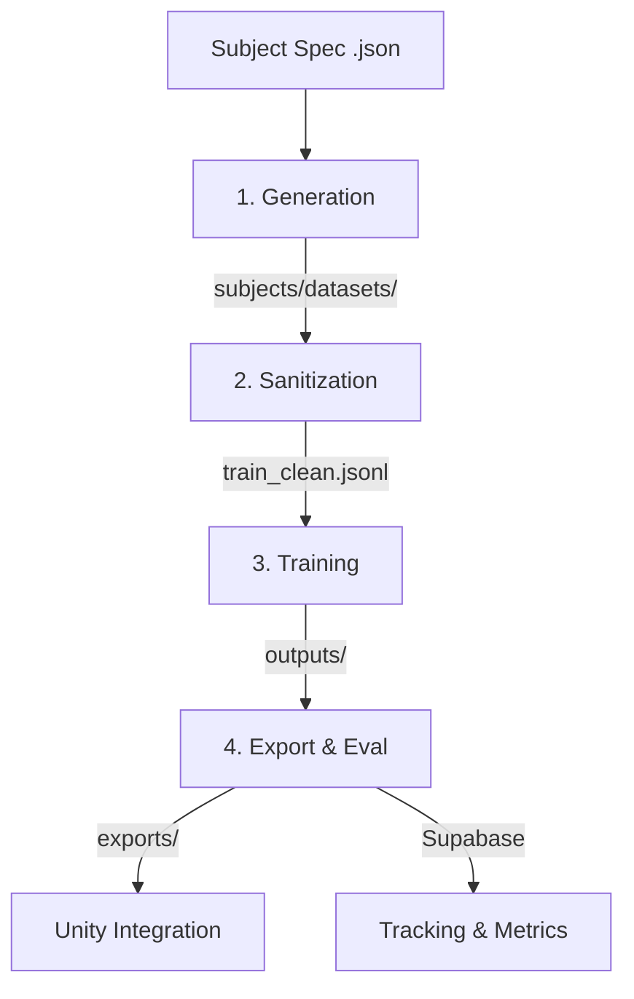

# Pipeline Flow: From Spec to NPC

Unsloth_Core follows a deterministic 4-stage pipeline to transform an NPC subject specification into a deployable GGUF model.

## 🔄 High-Level Workflow

---

## 🟢 Stage 1: Generation
**Script**: `scripts/generate_dataset.py`  
**Inputs**: `subjects/NPC_specs/*.json`  
**Outputs**: `subjects/datasets/{npc_key}/{technique}/train.jsonl`

Using the `research_queries` defined in the subject spec, the generator fetches domain knowledge and synthesizes Q&A pairs.
- **Techniques**: `onyx` (default) for production datasets, `template` for smoke tests only.
- **Format**: All data is generated in **ChatML** format to ensure compatibility with modern instruct models.

---

## 🟡 Stage 2: Sanitization
**Script**: `scripts/sanitize_dataset.py`  
**Inputs**: `train.jsonl`  
**Outputs**: `train_clean.jsonl`

This stage acts as a quality gate. It performs:
- **ChatML Validation**: Ensuring all roles (`system`, `user`, `assistant`) are present and valid.
- **Whitespace Stripping**: Removing unnecessary leading/trailing spaces that can degrade model performance.
- **Deduplication**: Ensuring the model doesn't overfit on identical examples.

---

## 🔵 Stage 3: Training
**Script**: `scripts/train.py`  
**Inputs**: `train_clean.jsonl` + `configs/presets/*.yaml`  
**Outputs**: `outputs/{npc_key}/` (LoRA Adapter)

The heart of the project. It uses **Unsloth** for extremely memory-efficient fine-tuning.
- **LoRA**: Instead of training billions of parameters, we train a small "adapter" (typically 50-200MB).
- **Presets**: Standardized settings (Learning Rate, Rank, Alpha) for different model sizes (1.7B, 3B, 7B).
- **Early Stopping**: The process monitors validation loss and stops when convergence is reached.

---

## 🔴 Stage 4: Export & Validation
**Scripts**: `scripts/export.py`, `scripts/smoke_test.py`  
**Inputs**: LoRA Adapter + Base Model  
**Outputs**: `exports/*.gguf`

The final stage converts the LoRA adapter to a lightweight GGUF (adapter mode, ~50 MB) or optionally full-merges it into the base model.
- **Default**: Adapter-only GGUF via `convert_lora_to_gguf.py` — no base model needed, loads via `llama-server --lora` (same as LLMUnity runtime).
- **Full-merge** (`--full-merge-export`): Merges + quantizes via `llama-quantize` (usually `q4_k_m`).
- **Smoke Testing**: Automated inference runs to verify the NPC still knows their name and expertise.
- **Supabase Tracking**: Metrics (Loss, Eval Score, VRAM) are pushed to the database for historical analysis.
