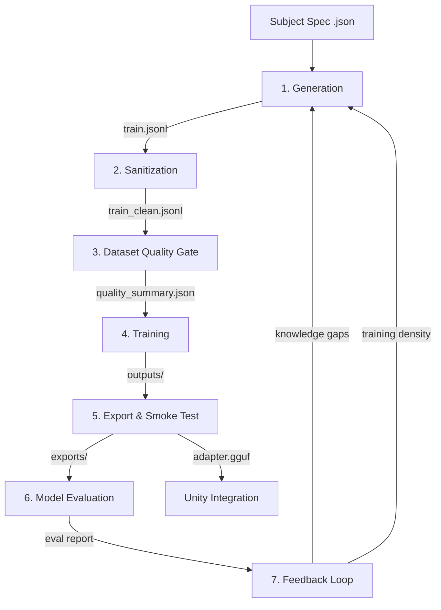

# Pipeline Flow: From Spec to NPC

Unsloth_Core follows a deterministic 7-stage pipeline to transform an NPC subject specification into a deployable GGUF model, with a feedback loop for continuous improvement.

## High-Level Workflow


```mermaid
graph TD
    A[Subject Spec .json] --> B[1. Generation]
    B -->|train.jsonl| C[2. Sanitization]
    C -->|train_clean.jsonl| D[3. Dataset Quality Gate]
    D -->|quality_summary.json| E[4. Training]
    E -->|outputs/| F[5. Export & Smoke Test]
    F -->|exports/| G[6. Model Evaluation]
    G -->|eval report| H[7. Feedback Loop]
    H -->|knowledge gaps| B
    H -->|training density| B
    F -->|adapter.gguf| I[Unity Integration]
```

---

## Stage 1: Generation

**Script**: `scripts/dataset/generate_dataset.py`
**Inputs**: `subjects/NPC_specs/{npc_key}.json` + `subjects/reference_docs/{npc_key}_primer.md`
**Outputs**: `subjects/datasets/{npc_key}/{technique}/train.jsonl`

Generates 132 training examples (ChatML format) across 5 categories:
- **identity** (12): Who the NPC is — personality, background, mannerisms
- **teaching** (56): Subject-matter explanations
- **dialogue** (32): Natural conversation handling
- **quest** (16): Scenario-based interactions
- **refusal** (16): Safe boundary responses

### Active Techniques

| Technique | Description | Best For |
|-----------|-------------|----------|
| `template` | Fast deterministic generation from spec patterns | Smoke tests, pipeline validation |
| `docs` | Deterministic generation grounded in curated reference docs | Production datasets |
| `ollama` | LLM-driven synthetic data via local Ollama | Rich varied examples (offline) |
| `openai` | Cloud-based LLM generation | Maximum quality (requires API key) |
| `anthropic` | Cloud-based LLM generation via Claude | Alternative cloud generator |

Dataset counts follow the 5-category contract with minimums enforced by `validate-spec --generation-ready`.

---

## Stage 2: Sanitization

**Script**: `scripts/dataset/sanitize_dataset.py`
**Inputs**: `train.jsonl`
**Outputs**: `train_clean.jsonl`

This stage acts as a quality gate:
- **ChatML Validation**: Ensures all roles (`system`, `user`, `assistant`) are present and valid
- **Whitespace Stripping**: Removes unnecessary leading/trailing spaces
- **Deduplication**: Removes identical examples to prevent overfitting
- **Null Byte Removal**: Strips null characters that can corrupt training
- **AI Artifact Removal**: Detects and removes common LLM-generation artifacts
- **Complete Metadata**: Validates required metadata fields (`--require-complete-metadata`)
- **Canonical Format**: Enforces strict canonical ChatML (`--strict-canonical`)

Standard output: `.../{technique}/train_clean.jsonl`

---

## Stage 3: Dataset Quality Gate

**Script**: `scripts/dataset/dataset_eval.py` + `tests/evals/test_dataset_generation_quality.py`
**Inputs**: `train_clean.jsonl`
**Outputs**: `quality_summary.json` + `quality_failures.json`

Uses **DeepEval** with a local Ollama judge (`qwen3:latest`, 8.2B params at Q4_K_M) to evaluate dataset quality before training:

```bash
./ucore dataset-eval subjects/NPC_specs/history_guide.json \
  --technique template --judge-model qwen3:latest
```

- Metrics check persona/category fit and training usefulness/specificity
- Failing rows are written to `quality_failures.json`
- Fix generation, prompts, or reference material — never lower thresholds
- Bypass with `--deepeval-soft-fail` to continue training despite failures

**Decision rule**: Treat `quality_failures.json` as the source of truth for what to regenerate. Do not delete rows or change thresholds to force a pass.

---

## Stage 4: Training

**Script**: `scripts/training/train.py`
**Inputs**: `train_clean.jsonl` + `configs/presets/*.yaml`
**Outputs**: `outputs/{npc_key}/` (LoRA adapter)

The heart of the project. Uses **Unsloth SFTTrainer** for memory-efficient fine-tuning:
- **LoRA**: Trains a small adapter (50-200MB) instead of fine-tuning the full model
- **Early Stopping**: Monitors validation loss and stops on convergence
- **Config Hierarchy**: Base YAML < Preset < CLI flag overrides

### Presets

| Preset | Model Size | Batch | Learning Rate | When to Use |
|--------|-----------|-------|---------------|-------------|
| `smoke` | Any | 1 | 2e-4 | Debugging/testing (1 epoch, few steps) |
| `fast-3b` | 3B-1.7B | 2 | 2e-4 | Standard NPC training (RTX 3060 6GB) |
| `safe-any` | Any | 1 | 1e-4 | Low-VRAM fallback (under 6GB) |

### Export Flag
- `--export-gguf`: Runs post-training GGUF conversion inline
- `--full-merge-export`: Produces a standalone merged GGUF

### Training Artifacts
- Adapter weights (`outputs/{npc_key}/`)
- TensorBoard logs for loss visualization
- Config snapshot (frozen for reproducibility)
- W&B integration via `--wandb`

---

## Stage 5: Export & Smoke Test

**Scripts**: `scripts/export/export.py`, `scripts/export/batch_export.py`, `scripts/ops/smoke_test.py`
**Inputs**: LoRA adapter + base model config
**Outputs**: `exports/{npc_key}/{npc_key}-lora-f16.gguf`

### Adapter Mode (Default)
- Runs `convert_lora_to_gguf.py` from `llama.cpp`
- Output: Lightweight adapter GGUF (~50 MB, varies by rank)
- No base model needed for loading
- Loaded via `llama-server --lora` (same mechanism as LLMUnity runtime)

### Full-Merge Mode (`--full-merge-export`)
- Merges LoRA weights into base model
- Quantizes via `llama-quantize` (default: `q4_k_m`)
- Output: Standalone GGUF (several GB)
- Named: `{npc_key}-{model_short}-{quant}.gguf`

### Smoke Test
Automated inference runs verify:
- NPC knows their own name and identity
- NPC can explain their subject matter
- Refusal responses work for out-of-domain queries
- Response length stays within token budget

---

## Stage 6: Model Evaluation

**Script**: `scripts/evaluation/evaluate.py`
**Inputs**: Baseline GGUF, candidate GGUF, NPC spec
**Outputs**: HTML report, markdown breakdown, structured feedback JSON

Supports two modes:
- **Side-by-side**: Compare baseline vs candidate on the same questions
- **Standalone**: Score a single model against spec-defined criteria

```bash
# Side-by-side evaluation (adapter GGUF with base model)
./ucore evaluate --baseline exports/old-lora-f16.gguf \
  --candidate exports/new-lora-f16.gguf \
  --base-model ~/.unsloth/models/llama-3.2-3b-instruct-q4_k_m.gguf \
  --spec subjects/NPC_specs/npc.json \
  --report-html

# With feedback JSON for the feedback loop
./ucore evaluate --baseline old.gguf --candidate new.gguf \
  --spec subjects/NPC_specs/npc.json \
  --feedback-json eval/results/feedback/npc.json
```

Uses `llama-server --lora` for adapter evaluation — no full-merge needed.

---

## Stage 7: Feedback Loop

**Script**: `scripts/training/feedback_loop.py`, `scripts/evaluation/evaluate.py --feedback-json`
**Inputs**: Evaluation feedback JSON
**Outputs**: Gap analysis, regeneration plan

### Gap Detection

| Gap Type | Cause | Fix |
|----------|-------|-----|
| `training_density` | Not enough training examples on a concept | Regenerate with `--concept-focus` targeting the weak concept |
| `knowledge_gap` | Missing reference material in the primer | Add reference docs, re-index, regenerate using `docs` technique |

### Auto-Retrain

```bash
# Full auto-retrain (CI mode)
./ucore feedback eval/results/feedback/npc.json --auto --auto-retrain \
  --baseline old.gguf --train-preset fast-3b
```

This chains: regenerate → sanitize → dataset-eval → train → evaluate.

### VRAM Note (6GB)
Do NOT use `--auto-retrain` with LLM-based generation (`ollama`/`openai`) on an RTX 3060 6GB. Run generation first (`--auto`), unload Ollama from memory, then train manually to avoid OOM.

---

## Workflow Hooks

Every pipeline stage writes lifecycle events to a `workflow_hooks.jsonl` file, co-located with the stage output. The hook system uses the `step()` context manager convention:

```python
with hook_recorder.step("generate_dataset", spec_path=spec, run_id=run_id) as ctx:
    ctx.log("Starting generation...")
    # ... pipeline work ...
    # Auto-captures: start on entry, complete on exit, error on exception
```

Events include: timestamp, step name, status (start/complete/error), spec_path, run_id, and step-specific metadata.

Use `WorkflowHookReader.pipeline_summary(path)` to read hook files:
```python
from scripts.ops.workflow_hooks import WorkflowHookReader

summary = WorkflowHookReader.pipeline_summary("outputs/history_guide/runs/run_20260520_123456/workflow_hooks.jsonl")
# Returns: {"total_events": 24, "traces": [...]}
```

## DB Integration

All 6 pipeline tables (jobs, runs, artifacts, quality gates, eval sessions, config snapshots) are populated automatically by the WorkflowHookRecorder + PipelineDB combo:

- **pipeline_jobs**: Created on step start, updated on complete/error
- **pipeline_runs**: Tracked per-training execution
- **pipeline_artifacts**: Recorded on step completion with file metadata
- **dataset_quality_gates**: Written after DeepEval runs
- **eval_sessions**: Written after model comparisons
- **pipeline_config_snapshots**: Frozen at training time for reproducibility

All writes are **best-effort** — a missing database never blocks the pipeline.

## Export Mode Summary

| Feature | Adapter Mode (Default) | Full-Merge (`--full-merge-export`) |
|---------|----------------------|-----------------------------------|
| Output size | ~50 MB (MBs) | Several GB |
| Dependencies | `convert_lora_to_gguf.py` | `llama-quantize` |
| Unity loading | `--lora` flag at runtime | Standalone GGUF |
| Storage | One base model + many adapters | One file per NPC |
| Recommended for | Development, multi-NPC games | Distribution, performance-critical |

---

## Quick Reference CLI

```bash
./ucore validate-spec subjects/NPC_specs/npc.json --generation-ready
./ucore generate subjects/NPC_specs/npc.json --technique template
./ucore sanitize subjects/datasets/npc/template/train.jsonl --strict-canonical
./ucore dataset-eval subjects/NPC_specs/npc.json --technique template
./ucore train subjects/NPC_specs/npc.json --preset fast-3b --export-gguf
./ucore smoke exports/npc/npc-lora-f16.gguf
./ucore evaluate --baseline old.gguf --candidate new.gguf --spec subjects/NPC_specs/npc.json
./ucore feedback eval/results/feedback/npc.json --auto
```
