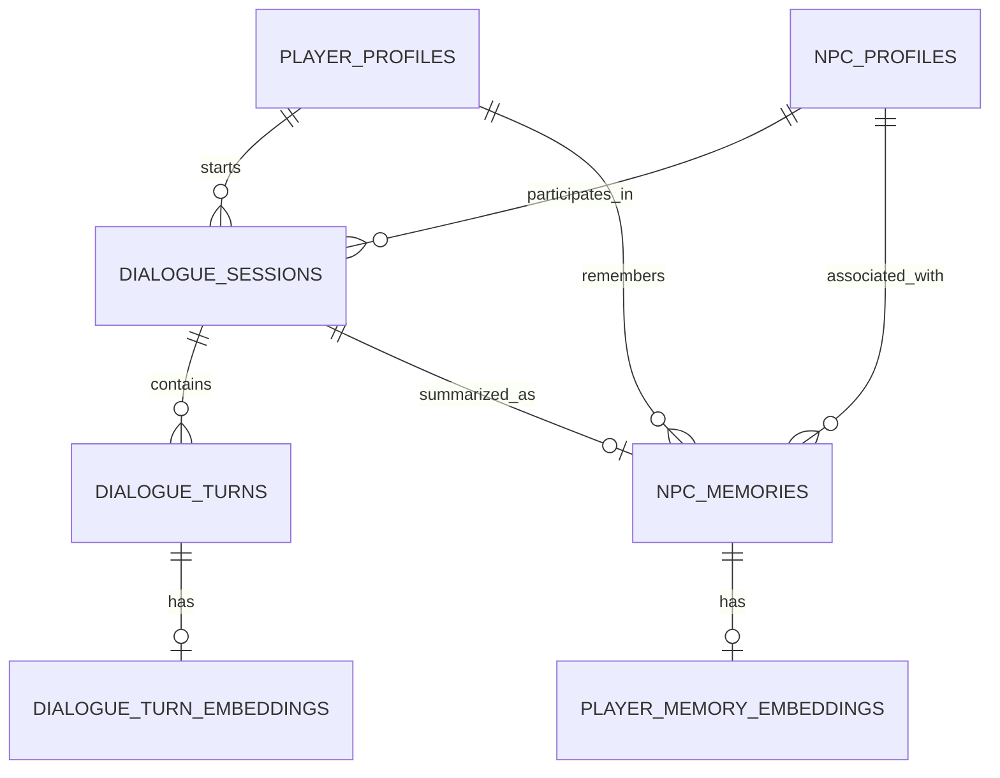

# Supabase Architecture: NPC Core Backend

Unsloth_Core uses a local Supabase instance for real-time tracking of NPCs, dialogue sessions, and semantic memories.

## 📊 Entity Relationship Diagram

## 🗄️ Primary Tables

### `npc_profiles`
The central catalog of NPCs.
- `npc_id` (PK): The unique `npc_key` from the subject spec.
- `npc_name`: Internal name.
- `display_name`: Name shown to the player.
- `system_prompt`: The persona definition.
- `lora_path`: Relative path to the trained adapter.

### `dialogue_sessions`
Tracks active and ended conversations.
- `status`: `active`, `paused`, `ended`, or `archived`.
- `turn_count`: Number of messages in the session.
- `summary`: A generated summary of the conversation (stored upon ending).

### `dialogue_turns`
Individual messages within a session.
- `role`: `player`, `npc`, `system`, or `god`.
- `content`: The message text.
- `tokens_used`: Consumption tracking.

### `npc_memories`
Cross-session semantic memory for an NPC/Player pair.
- `memory_type`: `summary`, `fact`, `preference`, `relationship`.
- `importance`: 0.0 to 1.0 (weight for retrieval).
- `embedding`: Vector(768) for semantic search.

---

## ⚙️ Key Database Functions (RPCs)

### `get_or_create_session(p_player_id, p_npc_id)`
Finds an existing `active` session for the pair or initializes a new one. This ensures continuity in NPC interactions.

### `insert_turn_fast(p_session_id, ...)`
Optimized function to add a dialogue turn and atomically increment the session's `turn_count`.

### `summarize_dialogue_session(p_session_id, p_summary)`
Marks a session as `ended` and creates a new entry in `npc_memories` of type `summary`.

### `search_memories_semantic(p_player_id, p_npc_id, p_query_embedding)`
Performs a vector cosine similarity search over the `npc_memories` table to retrieve relevant context for an NPC response.

---

## 🔒 Security (RLS)
The schema is configured with **Row Level Security (RLS)**. In the local development environment, public policies allow the Unity client to interact with the database directly for rapid iteration. In production, these would be tightened to authenticated access.
