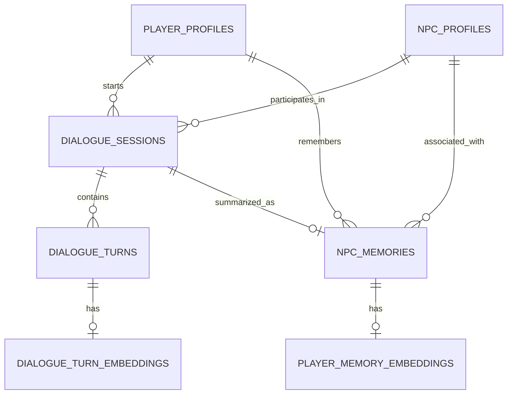
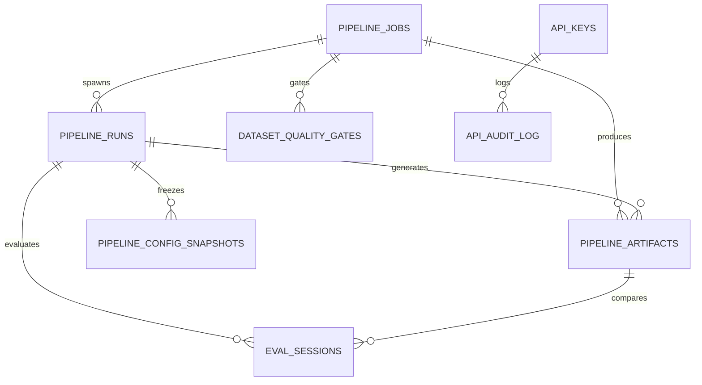

# Supabase Architecture: NPC Core Backend

Unsloth_Core uses a local Supabase instance for real-time tracking of NPCs, dialogue sessions, semantic memories, and the entire pipeline state.

> **Connection**: The `PipelineDB` class auto-detects the database via `SUPABASE_DB_URL`, `PIPELINE_DB_URL`, or falls back to `127.0.0.1:15434`. Writes are best-effort and never block the pipeline.

## Section 1: Runtime Tables (NPC Dialogue)

These tables support the Unity LLMUnity runtime for NPC dialogue and memory.

### Entity Relationship Diagram

### `npc_profiles`
The central catalog of NPCs.
- `npc_id` (PK): The unique `npc_key` from the subject spec.
- `npc_name`: Internal name.
- `display_name`: Name shown to the player.
- `system_prompt`: The persona definition.
- `lora_path`: Relative path to the trained adapter.
- `lora_weight`: Scaling factor for the LoRA adapter (default 1.0).
- `subject_spec`: Full subject spec JSON.
- `voice_rules`, `domain_knowledge`: NPC behavior parameters.

### `dialogue_sessions`
Tracks active and ended conversations.
- `status`: `active`, `paused`, `ended`, or `archived`.
- `turn_count`: Number of messages in the session.
- `summary`: A generated summary of the conversation (stored upon ending).

### `dialogue_turns`
Individual messages within a session.
- `role`: `player`, `npc`, `system`, or `god`.
- `content`: The message text.
- `tokens_used`: Consumption tracking.

### `npc_memories`
Cross-session semantic memory for an NPC/Player pair.
- `memory_type`: `summary`, `fact`, `preference`, `relationship`.
- `importance`: 0.0 to 1.0 (weight for retrieval).
- `embedding`: Vector(768) for semantic search.

### `player_profiles`
Player identity and authentication records.
- Linked to dialogue sessions and NPC memories for per-player context.

### Key Database Functions (RPCs)

- `get_or_create_session(p_player_id, p_npc_id)` — Finds an existing `active` session for the pair or initializes a new one.
- `insert_turn_fast(p_session_id, ...)` — Optimized function to add a dialogue turn and atomically increment `turn_count`.
- `summarize_dialogue_session(p_session_id, p_summary)` — Marks session as `ended` and creates a `summary` memory entry.
- `search_memories_semantic(p_player_id, p_npc_id, p_query_embedding)` — Vector cosine similarity search over `npc_memories`.

---

## Section 2: Pipeline Tables

These 8 tables track the entire pipeline from generation through deployment.

### Entity Relationship Diagram

### `pipeline_jobs`
Persistent job queue — every command execution creates a row.
- `id` (UUID PK): Auto-generated.
- `npc_key`: Target NPC identifier.
- `type`: Dataset, Training, Evaluation, Export, Validation, Feedback, System, Pipeline.
- `command_id`, `command_args`: Command definition and parameters.
- `status`: pending, running, completed, failed, stopped, paused.
- `progress` (0-100), `loss`, `exit_code`, `error`, `wandb_url`.
- `workflow_id`, `chain_next`: Workflow chaining state.
- `logs` (TEXT[]), `metadata` (JSONB).
- `spec_path`: NPC spec file path (added in migration b6).
- Timestamps: `created_at`, `started_at`, `finished_at`, `updated_at`.

### `pipeline_runs`
Training run metadata — one row per training execution.
- `id` (UUID PK), `job_id` (FK → pipeline_jobs).
- `npc_key`, `run_id` (unique per NPC), `run_dir`.
- `preset`, `model_id`, `technique`, `base_model`.
- `config_snapshot` (JSONB), `metrics` (JSONB), `lora_config` (JSONB).
- `wandb_enabled`, `wandb_url`, `has_adapter`, `has_tensorboard`.
- `status`: pending, running, completed, failed (added in migration b7).
- `spec_path`: NPC spec used (added in migration b6).

### `pipeline_artifacts`
Track all generated files — datasets, adapters, GGUF exports.
- `id` (UUID PK), `npc_key`, `run_id`, `job_id` (FK → pipeline_jobs).
- `artifact_type`: dataset_raw, dataset_clean, adapter, gguf_adapter, gguf_full, eval_report, feedback_json, config_snapshot, other.
- `technique`, `file_path`, `file_size_bytes`, `file_hash`, `metadata` (JSONB).

### `dataset_quality_gates`
DeepEval quality gate results — one row per evaluation run.
- `id` (UUID PK), `npc_key`, `technique`, `job_id` (FK → pipeline_jobs).
- `dataset_path`, `judge_model` (default: qwen2.5:7b).
- `total_samples`, `passed`, `failed`, `pass_rate`.
- `metrics` (JSONB), `categories` (JSONB), `failures` (JSONB), `failures_path`.

### `eval_sessions`
Side-by-side evaluation results — win/loss per concept.
- `id` (UUID PK), `npc_key`.
- `baseline_artifact_id`, `candidate_artifact_id` (FK → pipeline_artifacts).
- `total_examples`, `baseline_wins`, `candidate_wins`, `ties`, `win_rate`.
- `per_concept` (JSONB), `weak_concepts` (TEXT[]).
- `feedback_json_path`, `report_html_path`, `metadata` (JSONB).

### `pipeline_config_snapshots`
Frozen training configurations — immutable record.
- `id` (UUID PK), `npc_key`, `preset`, `technique`.
- `full_config` (JSONB), `file_path`, `hash`.

### `api_keys`
API key authentication for dashboard and pipeline access.
- `id` (UUID PK), `key_hash` (bcrypt).
- `key_prefix` (first 8 hex chars, indexed for fast lookup).
- `name`, `role` (admin/operator/viewer), `is_active`.
- `last_used_at`, `expires_at`.

### `api_audit_log`
Audit trail for all mutation requests.
- `id` (UUID PK), `api_key_id` (FK → api_keys).
- `user_role`, `method`, `path`, `status_code`.
- `request_body` (redacted, max 2000 chars).
- `ip_address`, `duration_ms`.

---

## Section 3: Helper Functions

### `upsert_pipeline_job(p_npc_key, p_type, p_command_id, p_command_args)`
Creates a new job or updates an existing pending/running job for the same NPC and command. Returns the pipeline_jobs row.

### `complete_pipeline_job(p_job_id, p_status, p_exit_code, p_error)`
Marks a job as completed, failed, or stopped. Sets `finished_at` and `updated_at`. Raises if job not found.

### `insert_pipeline_artifact(p_npc_key, p_artifact_type, p_file_path, p_run_id, p_technique, p_job_id, p_file_size_bytes, p_metadata)`
Records a generated file in pipeline_artifacts.

---

## Section 4: Extensions

| Extension | Version | Purpose |
|-----------|---------|---------|
| `pg_trgm` | 1.6 | Trigram text similarity for fuzzy NPC memory search, dialogue matching, near-duplicate dataset detection |
| `fuzzystrmatch` | 1.2 | Levenshtein, soundex, metaphone for spellcheck and fuzzy NPC name matching |
| `vector` | 0.5.1 | Vector embedding support (768d) for semantic memory search |
| `hypopg` | — | Hypothetical indexes for query planning optimization |
| `index_advisor` | — | Index recommendations for slow pipeline queries |
| `pgaudit` | — | Database-level audit logging (complements api_audit_log) |

Extensions are enabled via migrations (not psql) so they persist through `supabase db reset`.

---

## Section 5: Indexes

| Table | Index | Purpose |
|-------|-------|---------|
| pipeline_jobs | idx_pipeline_jobs_status | Quick filter by job status |
| pipeline_jobs | idx_pipeline_jobs_npc | Lookup jobs for a specific NPC |
| pipeline_jobs | idx_pipeline_jobs_created | Time-ordered listing (DESC) |
| pipeline_runs | idx_pipeline_runs_npc | Lookup runs by NPC |
| pipeline_runs | idx_pipeline_runs_created | Time-ordered listing (DESC) |
| pipeline_runs | idx_pipeline_runs_status | Filter runs by status |
| pipeline_artifacts | idx_pipeline_artifacts_npc | Lookup artifacts by NPC |
| pipeline_artifacts | idx_pipeline_artifacts_type | Filter by artifact type |
| dataset_quality_gates | idx_quality_gates_npc | Lookup gates by NPC |
| dataset_quality_gates | idx_quality_gates_created | Time-ordered listing (DESC) |
| eval_sessions | idx_eval_sessions_npc | Lookup evals by NPC |
| eval_sessions | idx_eval_sessions_created | Time-ordered listing (DESC) |
| pipeline_config_snapshots | idx_config_snapshots_npc | Lookup snapshots by NPC |
| api_audit_log | idx_audit_log_path | Query audit trail by endpoint |
| api_audit_log | idx_audit_log_created | Time-ordered audit listing (DESC) |
| player_profiles | idx_player_profiles_email | Player lookup by email |
| player_profiles | idx_player_profiles_auth | Composite auth provider lookup |

(14 pipeline indexes + 2 runtime indexes + 2 profile indexes)

---

## Security (RLS)

All 8 pipeline tables and the runtime tables have Row Level Security enabled. In the local development environment, open (public) policies allow direct access for rapid iteration. In production, these should be tightened to role-based policies matching the auth system's admin/operator/viewer roles.

---

## Realtime

The `supabase_realtime` publication broadcasts changes on all 6 pipeline tables (jobs, runs, artifacts, quality_gates, eval_sessions, config_snapshots) for live dashboard updates without polling.
