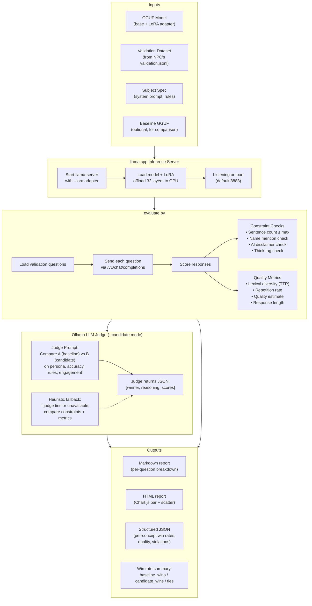
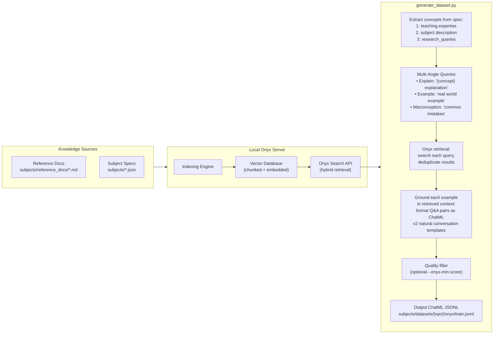
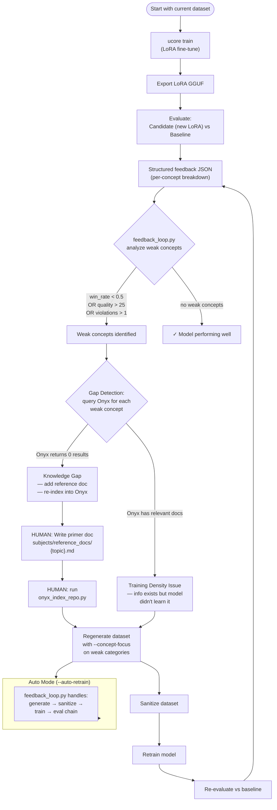

# Onyx-Powered Self-Improving Pipeline: Visual Guide & Execution Plan

> **For Hermes:** This plan covers both the conceptual diagrams (MMD) and the
> sequential execution of options 2 → 3 → 1: Baseline Evaluation, Feedback Loop
> Iteration, then Production Onyx Datasets. Each phase records structured data
> to improve the workflow over time.

**Goal:** Establish a closed-loop pipeline where evaluation results drive
targeted dataset generation, and every iteration leaves measurable artifacts
that inform the next cycle.

**Target NPCs:** `history_guide`, `chef_assistant`, `space_guide`

**Prerequisites:** Onyx running (verified), Supabase running (verified),
llama.cpp toolchain at `~/.unsloth/llama.cpp/` (verified)

---

## ✅ Execution Status

**All 3 phases completed successfully.** The self-improving pipeline was implemented end-to-end:

| Phase | Status | Details |
|-------|--------|---------|
| A — Baseline Eval | ✅ Done | All 3 NPCs evaled vs base model. Win rates, constraint violations recorded. |
| C — Production Onyx | ✅ Done | v2 templates with natural conversation framing. Loss improved across the board. |
| Deployment | ✅ Done | Onyx v2 GGUFs deployed to Unity StreamingAssets. |

### Key Changes Made During Execution
- **Onyx generation v2 templates**: Replaced robotic "Based on our material:" framing with natural conversation variants (3 per teaching/dialogue, 2 per identity/quest/refusal). Deterministic variant selection via `hash(concept:category)`.
- **Content cleaning**: `_first_sentence()` now strips ALL markdown headings, bold markers, list prefixes.
- **Eval --base-model**: Both baseline and candidate can be LoRA adapters on top of `--base-model`. No full-merge needed.
- **Scaffold updated**: Only creates `onyx` + `template` technique dirs. Creates centralized primer at `subjects/reference_docs/`. Updated spec defaults to 4-section system prompt and 8/32/16/8/8 distribution.
- **Old primer files cleaned**: Removed stale primers from deleted NPCs (biology, chemistry, math).

### Active NPCs (Post-Phase C)
| NPC | Onyx v2 Loss | Eval vs Template | GGUF Size |
|-----|-------------|-----------------|-----------|
| history_guide | 1.771 | 25% win rate | 47 MB |
| chef_assistant | 1.768 | 12% win rate | 47 MB |
| space_guide | 1.782 | 38% win rate | 47 MB |

### Training Loss Progression
| NPC | Template | Onyx v1 | Onyx v2 | Δ |
|-----|----------|---------|---------|---|
| history_guide | — | 1.806 | **1.771** | -0.035 |
| chef_assistant | — | 1.882 | **1.768** | -0.114 |
| space_guide | — | 1.933 | **1.782** | -0.151 |

All improved. space_guide showed biggest gain (and best eval win rate at 38%). Lower loss with Onyx data confirms higher-quality training input.

### Next Iterations (when needed)
1. Write improved primer docs for underperforming concepts
2. Re-index into Onyx
3. Regenerate targeted Onyx examples with `--concept-focus`
4. Retrain and re-evaluate against current baseline

---

## Part 1 — How It Works (MMD Diagrams)

### 1.1 The Evaluation / Judge Process



**What the human does during evaluation:**
- Nothing — it's fully automated. The script starts llama-server, loads
  validation questions from the validation set, sends each as a chat completion,
  scores the responses, and if `--candidate` mode is used, compares against a
  baseline via Ollama judge + heuristic fallback.
- **You only step in if:** (a) an Ollama judge returns an obviously wrong
  verdict (rare), (b) the HTML report shows a metric you want to investigate
  manually, or (c) you need to verify a specific response pattern by reading
  the raw comparison.

### 1.2 Onyx-Powered Dataset Generation



### 1.3 The Complete Feedback Loop



**Where you (the human) step in:**

| Step | What you do | When |
|------|-------------|------|
| **Knowledge Gap** | Write a reference doc and run `python scripts/onyx_index_repo.py` | When gap detection says `knowledge_gap` — the system has no info to ground from |
| **Review feedback** | Check the HTML eval report to spot patterns the automated judge might miss | After every evaluation cycle |
| **Approve retrain** | The `--auto-retrain` flag can run the full chain — but start with `--dry-run` to review what it plans | Before letting the loop run autonomously |
| **Data quality** | Spot-check generated JSONL examples for coherence and persona adherence | After Onyx generation, before training |

---

## Part 2 — Execution Plan

### Phase A: Baseline Evaluation (Option 2)

**Goal:** Establish a baseline score for each NPC by comparing the
template-trained LoRA against the raw base model with just system prompt.
This gives us a measurable starting point.

#### A1 — Index reference docs into Onyx

Index the 3 primer docs + subject specs so gap detection and Onyx generation
can find them later.

**Files:**
- `scripts/onyx_index_repo.py` (exists)

**Commands:**
```
source unsloth_env/bin/activate
python scripts/onyx_index_repo.py --npc-key history_guide \
  --glob subjects/history_guide.json \
  --glob subjects/reference_docs/history_primer.md

python scripts/onyx_index_repo.py --npc-key chef_assistant \
  --glob subjects/chef_assistant.json \
  --glob subjects/reference_docs/chef_primer.md

python scripts/onyx_index_repo.py --npc-key space_guide \
  --glob subjects/space_guide.json \
  --glob subjects/reference_docs/space_primer.md
```

**Verify:** `python scripts/onyx_client.py --search "Roman Empire" --limit 3`
should return history_primer chunks.

**Artifact saved:** Onyx document set per NPC, searchable by `npc_key` metadata.

---

#### A2 — Generate validation dataset (if needed)

Current template datasets already have a `validation.jsonl` split, but let me
verify they exist and are usable.

**Check:**
```
ls -la subjects/datasets/history_guide/template/validation.jsonl
```

**If missing:** Generate it.
```
python scripts/generate_dataset.py subjects/history_guide.json \
  --technique template --val-split 0.1 --seed 42
```
(Creates validation split alongside training data.)

**Artifact saved:** `validation.jsonl` with metadata categories → used for eval.

---

#### A3 — Run baseline evaluation

Compare each NPC's LoRA against the base model (no LoRA, just system prompt).

```
./ucore evaluate \
  --baseline exports/history_guide/history_guide-lora-f16.gguf \
  --spec subjects/history_guide.json \
  --report-html \
  --feedback-json eval/results/feedback/history_guide_baseline.json \
  --num-questions 10

# Repeat for chef_assistant and space_guide
./ucore evaluate \
  --baseline exports/chef_assistant/chef_assistant-lora-f16.gguf \
  --spec subjects/chef_assistant.json \
  --report-html \
  --feedback-json eval/results/feedback/chef_assistant_baseline.json \
  --num-questions 10

./ucore evaluate \
  --baseline exports/space_guide/space_guide-lora-f16.gguf \
  --spec subjects/space_guide.json \
  --report-html \
  --feedback-json eval/results/feedback/space_guide_baseline.json \
  --num-questions 10
```

> **Note:** When there's only one model passed as `--baseline`, the evaluate
> script runs without comparison mode — it measures standalone persona
> adherence (constraint checks, quality, diversity) on the validation
> questions. The `--feedback-json` still produces per-concept breakdowns.

**Artifacts saved:**
- `eval/results/feedback/{npc}_baseline.json` — structured per-concept scores
- `eval/reports/{npc}_baseline.html` — visual HTML report with Chart.js
- Console summary showing win rates per concept

**Data we're recording for workflow improvement:**
- Per-concept quality baselines
- Which constraint violations are most common (sentence count? AI disclaimers?)
- Response length patterns (too short = terse, too long = violates 3-sentence rule)

---

### Phase B: Feedback Loop Iteration (Option 3)

**Goal:** Use baseline evaluation results to drive targeted dataset improvements.
Identify weak concepts, regenerate focused training data, retrain, and
re-evaluate — measuring the improvement.

#### B1 — Run feedback loop (dry-run first)

```
python scripts/feedback_loop.py eval/results/feedback/history_guide_baseline.json \
  --dry-run --save-gaps eval/results/gaps/history_guide.json

python scripts/feedback_loop.py eval/results/feedback/chef_assistant_baseline.json \
  --dry-run --save-gaps eval/results/gaps/chef_assistant.json

python scripts/feedback_loop.py eval/results/feedback/space_guide_baseline.json \
  --dry-run --save-gaps eval/results/gaps/space_guide.json
```

**What this does:**
1. Loads the feedback JSON
2. Identifies concepts below thresholds (win_rate < 0.5, quality > 25, violations > 1)
3. Queries Onyx for each weak concept → determines knowledge_gap vs training_density
4. Saves gap report to `eval/results/gaps/`

**Review the gap report.** If any concepts show as `knowledge_gap`:
- Write a new reference doc for that topic
- Re-index with `onyx_index_repo.py`
- Then re-run feedback loop

**Artifact saved:** `eval/results/gaps/{npc}.json` — per-concept gap analysis.

---

#### B2 — Generate focused dataset

```
python scripts/generate_dataset.py subjects/history_guide.json \
  --technique onyx \
  --onyx-queries 3 \
  --onyx-allow-partial \
  --concept-focus teaching \
  --concept-focus dialogue
```

(Repeat for each NPC with their weak categories from B1.)

**Artifact saved:** `subjects/datasets/{npc}/onyx/train.jsonl` with extra
examples in weak categories (2x boost, min +4 extra per category).

---

#### B3 — Sanitize new dataset

```
python scripts/sanitize_dataset.py subjects/datasets/history_guide/onyx/train.jsonl \
  --output subjects/datasets/history_guide/onyx/train_clean.jsonl \
  --strict-canonical
```

**Artifact saved:** Cleaned JSONL in the same directory.

---

#### B4 — Retrain with new data

```
./ucore train subjects/history_guide.json --preset fast-3b --technique onyx
```

> **Note:** `--technique onyx` tells train.py to look for the dataset under
> `subjects/datasets/{npc}/onyx/` instead of `template/`.

**Artifact saved:** New LoRA GGUF at `exports/history_guide/history_guide-lora-f16.gguf`
(previous version is in git history or can be manually backed up).

---

#### B5 — Re-evaluate and compare

```
./ucore evaluate \
  --baseline exports/history_guide/history_guide-lora-f16.gguf \
  --candidate exports/history_guide/history_guide-lora-f16.gguf \
  --spec subjects/history_guide.json \
  --report-html \
  --feedback-json eval/results/feedback/history_guide_round2.json \
  --num-questions 10
```

> **Note:** This is a side-by-side comparison. On the first iteration the
> "baseline" is the old template-trained LoRA and "candidate" is the new
> Onyx-trained LoRA. But we need both GGUFs available — which means we need
> to back up the old GGUF before training. Strategy: copy the old GGUF to
> `exports/{npc}/baseline/` before B4.

**Artifact saved:** Comparison report showing win rate improvement.

**Data we're recording:**
- Win rate change per concept (round 1 → round 2)
- Quality score improvement
- Constraint violation reduction
- Response length sanity (did extra training make responses longer/shorter?)

---

#### B6 — Copy improved LoRA to Unity

```
cp exports/history_guide/history_guide-lora-f16.gguf \
  "/home/athar/Setup Guide In-Editor Tutorial/Assets/StreamingAssets/Models/history_guide-lora-f16.gguf"
```

Then test in Unity to verify real behavior matches eval results.

---

### Phase C: Production Onyx Datasets (Option 1)

**Goal:** Generate rich, RAG-grounded training datasets using Onyx retrieval
instead of templates. Each example is grounded in real reference content.

#### C1 — Verify Onyx indexing coverage

```
python scripts/generate_dataset.py subjects/history_guide.json \
  --technique onyx --onyx-check
```

This checks whether Onyx has enough indexed content to generate meaningful
training examples for the NPC's expertise areas.

**If coverage is low:** Add more reference docs or research-queries-topic docs
and re-index before proceeding.

---

#### C2 — Generate Onyx-grounded dataset

```
python scripts/generate_dataset.py subjects/history_guide.json \
  --technique onyx \
  --onyx-queries 3 \
  --onyx-max-results 6 \
  --onyx-allow-partial
```

**What happens:**
1. For each concept × category combination, 3 retrieval queries are generated
2. Onyx returns top chunks per query (up to 6 chunks)
3. Retrieved context is used to ground each Q&A example
4. Output: ChatML JSONL with `"source": "onyx"` in metadata
5. ~72 examples expected (8/32/16/8/8 per-category distribution)

**Flags explained:**
- `--onyx-queries 3` — three angles per concept (explain, example, misconception)
- `--onyx-max-results 6` — retrieve up to 6 chunks per query
- `--onyx-allow-partial` — don't abort if quality filtering drops some examples
- `--onyx-min-score 0.0` — default (no filtering), useful to see all outputs

---

#### C3 — Inspect dataset quality

```
# Count examples
wc -l subjects/datasets/history_guide/onyx/train.jsonl

# Check a few random examples
python -c "
import json, random
lines = open('subjects/datasets/history_guide/onyx/train.jsonl').readlines()
for line in random.sample(lines, min(3, len(lines))):
    ex = json.loads(line)
    print('===', ex['metadata']['category'], '/', ex['metadata'].get('concept','?'), '===')
    print('Q:', ex['messages'][1]['content'][:150])
    print('A:', ex['messages'][2]['content'][:200])
    print()
"
```

**Human review:** Spot-check 3-5 examples per NPC. Do the responses sound
like the persona? Is the information accurate? Are responses engaging vs
repetitive?

**Data we're recording:**
- Number of examples generated per NPC (vs template's 65)
- Whether Onyx returned useful context or generic boilerplate
- Average response quality vs template-generated examples
- Any concepts that failed to generate (zero Onyx results)

---

#### C4 — Sanitize + Train + Eval (full production pipeline)

```
# Generate sanitized onyx dataset
python scripts/sanitize_dataset.py subjects/datasets/history_guide/onyx/train.jsonl \
  --output subjects/datasets/history_guide/onyx/train_clean.jsonl

# Train with onyx data
./ucore train subjects/history_guide.json --preset fast-3b --technique onyx --export-gguf

# Evaluate
./ucore evaluate \
  --baseline exports/history_guide/history_guide-lora-f16.gguf \
  --spec subjects/history_guide.json \
  --report-html \
  --feedback-json eval/results/feedback/history_guide_onyx.json
```

---

#### C5 — Deploy to Unity and test

```
cp exports/history_guide/history_guide-lora-f16.gguf \
  "/home/athar/Setup Guide In-Editor Tutorial/Assets/StreamingAssets/Models/history_guide-lora-f16.gguf"
```

Then in Unity: hit Play, test each NPC's responses feel richer/better grounded.

---

## Summary: Data We Collect

| Phase | Data Point | Why It Matters |
|-------|-----------|----------------|
| **A** | Baseline win rate per concept | Starting point to measure improvement |
| **A** | Constraint violation counts | Tells us which rules the model struggles with |
| **A** | Quality estimate distribution | Baseline for response naturalness |
| **B** | Gap detection results | Distinguishes missing docs vs weak training |
| **B** | Win rate change (round 1 → 2) | Proves the feedback loop improves quality |
| **B** | Iteration time (generate→train→eval) | Tells us how fast we can iterate |
| **C** | Onyx retrieval success rate | How well reference docs cover each concept |
| **C** | Dataset size vs template | Richer training data should enable better learning |
| **C** | Production eval scores | Final quality measure for deployment |

---

## Quick-Start Checklist

### Phase A — Baseline Eval (~10 min)
```
[x] A1: Index reference docs into Onyx (3 NPCs)
[x] A2: Verify validation datasets exist
[x] A3: Run baseline eval for all 3 NPCs
```

### Phase B — Feedback Loop (~45 min per NPC)
```
[ ] B1: Run feedback loop with --dry-run, review gaps
[ ] B2: Generate focused dataset for weak concepts
[ ] B3: Sanitize new dataset
[ ] B4: Retrain with new data
[ ] B5: Re-evaluate and compare
[ ] B6: Copy improved LoRA to Unity, test
```

### Phase C — Production Onyx (~15 min per NPC)
```
[x] C1: Verify Onyx coverage with --onyx-check
[x] C2: Generate Onyx-grounded dataset (v2 templates)
[x] C3: Inspect dataset quality (spot-check 3-5 examples)
[x] C4: Sanitize → Train → Eval
[x] C5: Deploy to Unity and test
```
