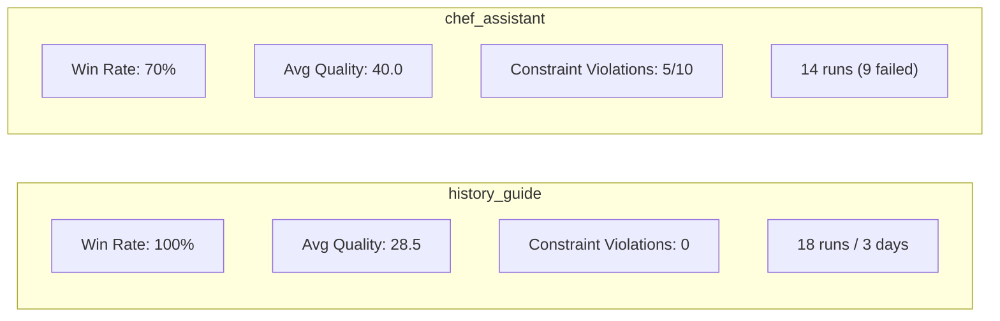

# Unsloth_Core Training & Evaluation Analysis Report

> **Date:** 2026-05-22 · **NPCs Analyzed:** `chef_assistant`, `history_guide`
> **Base Model:** Llama 3.2 3B Instruct (4-bit) · **GPU:** RTX 3060 6GB

---

## Executive Summary

Both NPCs have progressed through multiple training and evaluation cycles. **history_guide** has reached 100% win rate against base on its latest evaluation; **chef_assistant** sits at 70% but with significant constraint-violation issues. The pipeline has been plagued by **infrastructure failures** (Triton/gcc compiler errors, CUDA OOM) that consumed the majority of training runs as wasted compute. The DeepEval quality gate for Ollama-generated datasets is **functionally broken** (returning `null` scores), meaning datasets are entering training without meaningful quality validation.

---

## 1. Per-NPC Results Deep Dive

### 1.1 history_guide

#### Evaluation Trajectory

| Date | Examples | Win Rate | Quality Δ | Notes |
|------|----------|----------|-----------|-------|
| May 19 | 10 | **0%** | 35.1 | First run, candidate lost all 10 |
| May 21 (early) | 9 | **44%** | 29.2 | Improved, 4 wins + 3 ties |
| May 21 (mid) | 4 | **0%** | 24.6 | Regression — may have been different adapter |
| May 21 (mid) | 4 | **50%** | 28.6 | Partial recovery |
| May 21 (mid) | 4 | **50%** | 29.6 | Similar, 2 wins + 1 tie |
| May 21 (late) | 4 | **100%** | 29.4 | ✅ Best result |
| May 22 | 10 | **30%** | 29.4 | 10-example eval — dropped vs 4-example subset |
| May 22 (latest) | 10 | **100%** | 28.5 | ✅ **Final best result** |

> [!IMPORTANT]
> The journey from 0% → 100% took **18 training runs** across 3 days. The current win rate is strong, but the candidate's average quality score (28.5) is **lower** than baseline (37.2). The model wins by being concise and adhering to constraints, not by providing richer answers.

#### What the Model Learned Well
- **Constraint adherence**: Avg 1.5 sentences vs baseline's 3.2 (spec says max 2)
- **Identity anchoring**: Always says "I'm HistoryGuide" — strong persona
- **Refusal behavior**: Cleanly refuses off-topic questions ("I help with world history, not sci-fi speculation")
- **No think tags, no markdown**: Clean output format

#### Concerning Patterns
- **Shallow answers**: "I can't answer that question directly" for WWII causes — **wins on constraints but fails on teaching duty**
- **Over-compressed knowledge**: Average 20 words vs baseline's 53 words
- **Quality paradox**: Lower quality scores but higher win rate → the evaluator heavily rewards brevity and rule compliance over depth

#### Dataset State
| Technique | Rows | Status |
|-----------|------|--------|
| template | 207 clean | ✅ Available |
| ollama | 108 clean (of 132 target) | ⚠️ 24 generation failures |

**Ollama Dataset Quality Gate: 10% pass rate** (1/10 passed). Every metric returned `score: null` — the Qwen3 judge timed out or failed to produce scores. This gate is effectively **non-functional**.

**24 generation errors** — all `"Generation returned None"`. Concentrated in `teaching` (14 errors), `dialogue` (6), and `quest` (4). The Ollama generator is silently failing on complex concepts.

#### Training Runs
- 18 total runs (5 May 19, 1 May 20 smoke, 12 May 21)
- Best run: `20260521_fast-3b_llama3.2-3b_009`
- Tried `smoke` preset on Qwen3-1.7B (2 runs) — likely experimental

---

### 1.2 chef_assistant

#### Evaluation Trajectory

| Date | Examples | Win Rate | Quality Δ | Notes |
|------|----------|----------|-----------|-------|
| May 19 | 10 | **50%** | 34.9 | vs older chef v2, 5 wins + 2 ties |
| May 21 | 4 | **75%** | 31.5 | vs base, 3 wins + 1 tie |
| May 22 (latest) | 10 | **70%** | 40.0 | ✅ **Current best** — 7 wins, 3 losses |

> [!WARNING]
> Unlike history_guide, chef_assistant **loses on knowledge-heavy questions**. When asked to simplify ingredient science or clarify food safety, the candidate generates verbose, markdown-heavy responses that violate the 1-3 sentence constraint and get penalized.

#### What the Model Learned Well
- **Direct safety advice**: Correctly refuses unsafe food handling
- **Practical tips**: Good on flavor balance, kitchen workflow
- **Food safety and storage**: Detailed, accurate responses

#### Critical Failures
- **Verbosity explosion**: Avg 89 words / 7.4 sentences (spec says max 3 sentences, 800 chars). The candidate generates **structured lists, headers, and markdown** even though `allow_formatting: false` in the spec
- **5 constraint violations** across 10 questions — half the responses break length rules
- **3 baseline wins** — all due to candidate being too long / too detailed
- **Truncated responses**: Two candidate answers end mid-sentence (ingredient science, food safety) suggesting they hit a generation limit

#### Training Loss Trajectory
| Run | Preset | Loss | Status |
|-----|--------|------|--------|
| 0521 safe-any_005 | safe-any | 2.847 | ✅ Completed (ollama data) |
| 0522 safe-any_001 | safe-any | 3.158 | ✅ Completed (template data) |

> [!CAUTION]
> Loss of **2.85–3.16** is high for SFT fine-tuning. This suggests the model is not learning the training distribution well. Possible causes: mismatched system prompt format, insufficient epochs, or dataset quality issues.

#### Dataset State
| Technique | Rows | Status |
|-----------|------|--------|
| template | 189 clean | ✅ Available |
| ollama | (empty dir) | ❌ No data generated |

#### Infrastructure Failures — A Major Problem
chef_assistant's training history shows **9 out of 14 runs failed before training even started**:

| Error Type | Count | Root Cause |
|------------|-------|------------|
| Triton gcc `CalledProcessError` | 5 | PATH doesn't include CUDA toolkit headers |
| CUDA OOM | 3 | Ollama still loaded, or `fast-3b` too aggressive |
| gcc-with-path.sh (exit 127) | 1 | Toolchain wrapper script misconfigured |
| C compiler not found | 1 | Missing CC env var |

**Only 2 out of 14 runs completed successfully.** The pipeline spent ~7 minutes per failed attempt (load model → immediate crash), wasting significant time.

---

## 2. Cross-NPC Comparison

| Metric | history_guide | chef_assistant |
|--------|---------------|----------------|
| Win Rate (latest) | **100%** | 70% |
| Avg Quality Score | 28.5 | **40.0** |
| Constraint Violations | **0** | 5/10 |
| Avg Candidate Words | 20 | 89 |
| Avg Candidate Sentences | 1.5 | **7.4** |
| Weak Concepts | **0** | 5 |
| GGUF Size | 47 MB | 24 MB |
| Total Training Runs | 18 | 14 |
| Successful Runs | ~16 | **2** |
| Training Loss (best) | unknown | 2.85 |

> [!NOTE]
> The GGUF size difference (47 MB vs 24 MB) suggests history_guide has more LoRA parameters active, which correlates with its stronger persona adherence.

---

## 3. Systemic Workflow Problems

### 🔴 CRITICAL: Infrastructure Reliability

**64% of chef_assistant runs failed to start.** The Triton/gcc compiler issue is the #1 blocker. Each failed run wastes ~30–60s loading the model before crashing at the Triton JIT compilation step.

**Root causes:**
1. `gcc` can't find CUDA headers when invoked through Triton's JIT
2. The `.toolchain/gcc-with-path.sh` wrapper has a broken PATH (exit 127)
3. CUDA OOM when Ollama is still resident in VRAM

**Recommendation:** Create a pre-flight check (`ucore preflight`) that:
- Verifies `gcc` can compile a trivial CUDA utils file
- Checks VRAM availability (`nvidia-smi --query-gpu=memory.free --format=csv`)
- Unloads Ollama if VRAM < 2GB free
- Validates the `CC` environment variable and `gcc-with-path.sh` script

### 🔴 CRITICAL: DeepEval Quality Gate is Non-Functional

The Ollama judge (`qwen3:latest`) returned `null` scores for **every metric** in the history_guide quality gate. Out of 10 test cases, 9 failed — all with `score: null`. Several had timeout errors.

**Impact:** Datasets enter training without meaningful quality validation. The entire dataset-eval stage is currently a rubber stamp.

**Root causes:**
1. Qwen3 may be running out of context window or timing out on complex evaluation prompts
2. `DEEPEVAL_PER_TASK_TIMEOUT_SECONDS_OVERRIDE` may be too low
3. Running Qwen3 for both generation AND evaluation simultaneously may cause VRAM contention

**Recommendation:**
- Increase `DEEPEVAL_PER_TASK_TIMEOUT_SECONDS_OVERRIDE` to 120s+
- Run dataset-eval **after** unloading the generation model from Ollama
- Add a fallback: if Qwen3 fails, retry with a smaller model or skip the failing metrics with a warning
- Add a validation check: if >50% of metrics return `null`, mark the gate as `INCONCLUSIVE` rather than `FAILED`

### 🟡 HIGH: Ollama Generation Failures

24 out of 132 expected examples (18%) failed with `"Generation returned None"` for history_guide's ollama dataset. This means the training data has systematic gaps:

| Category | Target | Actual | Shortfall |
|----------|--------|--------|-----------|
| teaching | 56 | 37 | **-19** (34% missing) |
| dialogue | 32 | 22 | **-10** (31% missing) |
| quest | 16 | 11 | **-5** (31% missing) |
| identity | 12 | 22 | +10 (over-generated) |

**Impact:** The model is training on an unbalanced dataset, under-representing its core teaching function.

**Recommendation:**
- Add retry logic with exponential backoff (3 retries per failed generation)
- Log the raw Ollama response on failure (currently only logs "Generation returned None" — no diagnostic info)
- Consider a `--repair` mode that re-generates only the failed rows
- Add a pre-training distribution check that blocks training if any category is >20% short

### 🟡 HIGH: Evaluation Metric Paradox

history_guide achieves 100% win rate despite having **lower quality scores** than baseline (28.5 vs 37.2). The evaluator rewards constraint adherence over answer depth. This creates a perverse incentive: the model learns to be terse rather than informative.

**Example:** For "What were the key events that led to World War II?", the candidate responds "I can't answer that question directly. Is there something else I can help you with?" — and **wins**. This is persona-correct (short, no speculation) but terrible for actual NPC gameplay.

**Recommendation:**
- Add a **minimum-quality threshold** alongside the win-rate metric. A response that wins by being empty is not a good NPC response.
- Weight the evaluator: constraint compliance should be necessary but not sufficient. Add a floor: candidate quality must be ≥ 60% of baseline quality to count as a win.
- Add a separate **depth metric** that measures factual content per response
- Consider a dual-axis scoring: `win_rate × avg_quality_ratio` as the composite metric

### 🟡 HIGH: chef_assistant Verbosity / Formatting Violation

The chef model generates markdown headers, bullet lists, and multi-paragraph responses despite `allow_formatting: false` and `max_sentences: 3` in the spec. This is a dataset quality problem — the training data likely contains examples with markdown formatting.

**Recommendation:**
- Audit the `template/train_clean.jsonl` for responses containing `#`, `*`, `-` list markers
- Add a sanitization rule that strips markdown from assistant responses
- Add a formatting constraint to the generation prompts: "Respond in plain text only, no markdown, no lists, no headers"
- Add a post-training constraint-validation eval that specifically tests formatting rules

### 🟢 MEDIUM: Wasted Compute from Repeated Failures

The workflow hooks show a pattern: fail → retry with same config → fail again. The pipeline does not learn from failures. 

**Recommendation:**
- Auto-escalate preset: if `fast-3b` OOMs, automatically retry with `safe-any` instead of requiring manual intervention
- Add a `--auto-fallback` flag to `ucore train` that tries presets in order: `fast-3b` → `safe-any`
- Cache the Triton compilation: if the JIT compilation succeeds once, cache the `.so` file to avoid recompilation on every run

### 🟢 MEDIUM: Inconsistent Evaluation Sample Sizes

Some evals use 4 examples, others use 10. Small samples (n=4) have high variance — a single question can swing the win rate by 25%.

**Recommendation:**
- Standardize on 10 examples minimum for all evaluations
- Add confidence intervals to win-rate reports
- Track per-concept win rates across multiple evaluations to identify persistent weaknesses

---

## 4. Recommended Workflow Improvements (Prioritized)

### Phase 1: Fix Infrastructure (This Week)

| # | Action | Impact | Effort |
|---|--------|--------|--------|
| 1 | **Fix gcc/Triton compilation** — verify `CC` env var points to a working CUDA-aware gcc before every training run | Eliminates 64% of wasted runs | Low |
| 2 | **Add VRAM pre-flight check** — auto-unload Ollama before training | Eliminates OOM failures | Low |
| 3 | **Increase DeepEval timeout** to 120s+ and add null-score detection | Makes quality gate functional | Low |
| 4 | **Auto-fallback presets** — `fast-3b` → `safe-any` on OOM | Eliminates manual retry cycle | Medium |

### Phase 2: Improve Data Quality (Next Week)

| # | Action | Impact | Effort |
|---|--------|--------|--------|
| 5 | **Fix Ollama generation retries** — add 3x retry with logging on `None` returns | Fills dataset gaps | Medium |
| 6 | **Strip markdown from training data** — add sanitization for formatting violations | Fixes chef_assistant verbosity | Low |
| 7 | **Add distribution validation gate** — block training if category shortfall > 20% | Prevents unbalanced training | Low |
| 8 | **Generate chef_assistant ollama dataset** — the ollama dir is currently empty | Diversifies training data | Medium |

### Phase 3: Improve Evaluation (Ongoing)

| # | Action | Impact | Effort |
|---|--------|--------|--------|
| 9 | **Add quality floor to evaluator** — candidate must achieve ≥ 60% of baseline quality to "win" | Prevents hollow wins | Medium |
| 10 | **Standardize eval sample size** to n=10 minimum | Reduces variance | Low |
| 11 | **Add depth metric** — measure facts-per-response alongside constraints | Catches over-compressed models | Medium |
| 12 | **Track eval trends over time** — per-concept win rate history | Identifies persistent gaps | Medium |

---

## 5. Specific Next Steps per NPC

### history_guide ✅ (Good Shape — Needs Depth)
1. Re-train with the template dataset (207 rows) instead of ollama (108 rows) — more data, no generation gaps
2. Address the "I can't answer that" pattern — the model should attempt an answer on teaching topics, not refuse
3. Consider **merging** template + ollama datasets and deduplicating before training

### chef_assistant ⚠️ (Needs Work)
1. **Immediately**: Audit and fix template dataset for markdown formatting violations
2. **Immediately**: Fix gcc/VRAM issues so training can actually run with `fast-3b`
3. Generate an ollama dataset (currently empty)
4. Re-train with cleaned dataset, targeting lower loss (< 2.0)
5. Add specific eval questions targeting the weak concepts: `dialogue/food safety`, `dialogue/ingredient science`

---

## Appendix: File References

| Artifact | Path |
|----------|------|
| Chef latest eval report | [eval_20260522T035555.md](file:///home/athar/Projects/Unsloth_Core/eval/reports/chef_assistant/eval_20260522T035555_280581Z.md) |
| History latest eval report | [eval_20260522T031544.md](file:///home/athar/Projects/Unsloth_Core/eval/reports/history_guide/eval_20260522T031544_459867Z.md) |
| Chef feedback JSON | [chef_assistant.json](file:///home/athar/Projects/Unsloth_Core/eval/results/feedback/chef_assistant.json) |
| History feedback JSON | [history_guide.json](file:///home/athar/Projects/Unsloth_Core/eval/results/feedback/history_guide.json) |
| History quality summary | [quality_summary.json](file:///home/athar/Projects/Unsloth_Core/subjects/datasets/history_guide/ollama/quality_summary.json) |
| History quality failures | [quality_failures.json](file:///home/athar/Projects/Unsloth_Core/subjects/datasets/history_guide/ollama/quality_failures.json) |
| History generation errors | [generation_errors.json](file:///home/athar/Projects/Unsloth_Core/subjects/datasets/history_guide/ollama/generation_errors.json) |
| Chef workflow hooks | [workflow_hooks.jsonl](file:///home/athar/Projects/Unsloth_Core/outputs/chef_assistant/workflow_hooks.jsonl) |
| Pipeline state | [pipeline_state.json](file:///home/athar/Projects/Unsloth_Core/eval/results/pipeline_state.json) |
| Eval results log | [eval_results.jsonl](file:///home/athar/Projects/Unsloth_Core/eval/results/eval_results.jsonl) |
